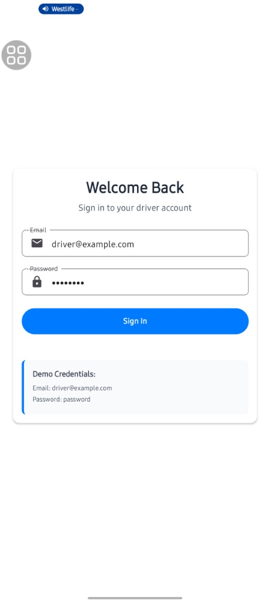
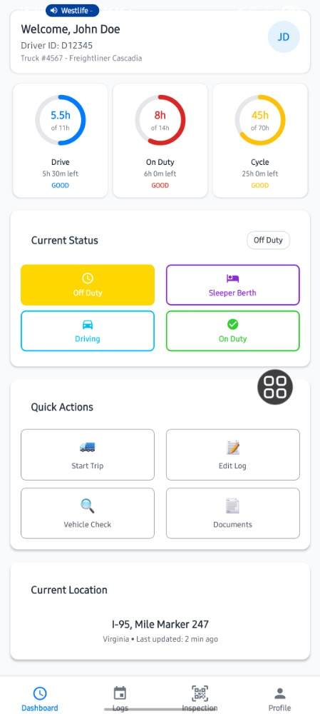
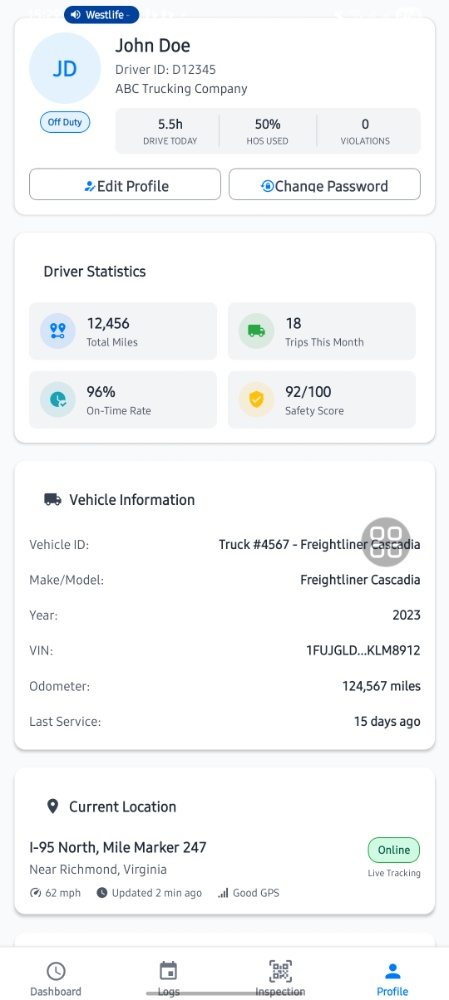
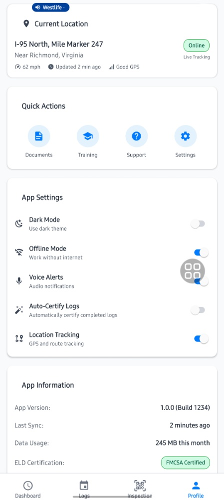

# 🚛 ELD Driver Management System (FleetLog)

[](https://opensource.org/licenses/MIT)
[](#)
[](https://expo.dev/)

## 📌 Project Overview
**FleetLog** is a high-performance Electronic Logging Device (ELD) solution tailored for the logistics industry. It automates **Hours of Service (HOS)** tracking to ensure strict adherence to FMCSA regulations. 

The system is engineered for the "road reality," featuring an **offline-first architecture** and an **Expo-managed workflow** that ensures data integrity even in cellular dead zones.

---

## 🚀 Key Features

### 1. Regulatory Compliance (HOS)
* **Real-time Monitoring:** Dynamic countdowns for "Drive," "On Duty," and "Cycle" timers.
* **Log Certification:** Logic-driven workflows that validate driver entries before submission.
* **Inspection Mode:** Instant data sharing (QR/USB/BT) for streamlined roadside law enforcement checks.

### 2. Advanced Engineering
* **Offline-First Sync:** Robust background synchronization logic for remote area operations.
* **Fleet Telematics:** Integrated GPS tracking and real-time vehicle diagnostics (VIN/Odometer).
* **Security:** JWT-secured authentication and read-only compliance modes.

### 3. User-Centric Design
* **Operational Ergonomics:** Dark Mode support for night driving and high-contrast UI for daylight.
* **Voice Alerts:** Proactive audio cues for violation warnings and status updates.

---

## 🛠 Tech Stack
* **Frontend:** React Native with **Expo** (Managed Workflow)
* **Backend:** Python (FastAPI / Flask)
* **Database:** PostgreSQL + TimescaleDB (Time-series optimization)
* **Infrastructure:** Docker, JWT Auth, Google Maps API

---

## 📸 Application Preview

### 1. Authentication & Dashboard
*Seamless onboarding with a high-visibility control center.*

<p align="center">
  
  
  
</p>

---

### 2. Logs & Compliance
*Detailed history tracking and secure roadside inspection mode.*

<p align="center">
  
  
</p>

---

### 3. Settings & Offline Management
*Granular control over device sync, dark mode, and location tracking.*

<p align="center">
  
</p>

---

## 🚦 Getting Started

### Prerequisites
* Node.js v18+
* Expo Go (on your mobile device) or an Emulator
* Python 3.9+

### Installation

1. **Clone the Repository**
   ```bash
   git clone [https://github.com/yourusername/eld-driver-app.git](https://github.com/yourusername/eld-driver-app.git)
````

2.  **Backend Setup**

    ```bash
    cd backend
    pip install -r requirements.txt
    python app.py
    ```

3.  **Frontend Setup (Expo)**

    ```bash
    cd frontend
    npm install
    npx expo start
    ```

> Scan the QR code with the **Expo Go** app to view the project on your physical device.

-----

## 👨‍💻 Author

**Joy Njoroge** *Quant-Dev / Data Analyst*

  * **Portfolio:** [www.joynjoroge.site](http://www.joynjoroge.site)
  * **LinkedIn:** [joynjorogesaas](https://www.google.com/search?q=https://linkedin.com/in/joynjorogesaas)

<!-- end list -->
